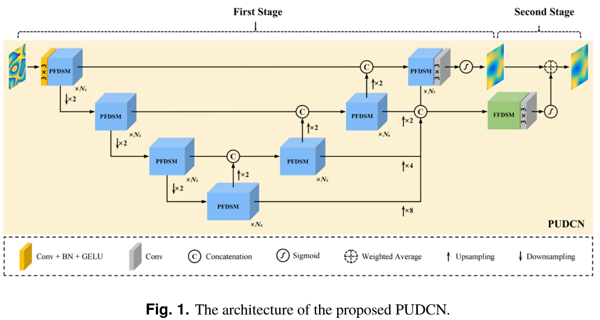

### PUDCN: two-dimensional phase unwrapping with deformable convolutional network
[[<u>Paper</u>]](https://opg.optica.org/oe/fulltext.cfm?uri=oe-32-16-27206&id=553306)
****

```
@article{Li:24,
author = {Youxing Li and Lingzhi Meng and Kai Zhang and Yin Zhang and Yaoqing Xie and Libo Yuan},
journal = {Opt. Express},
number = {16},
pages = {27206--27220},
title = {PUDCN: two-dimensional phase unwrapping with a deformable convolutional network},
volume = {32},
year = {2024},
}
 ```
 
 <div align="center">
  
  <br>
</div>

*Two-dimensional phase unwrapping is a fundamental yet vital task in optical imaging and measurement. In this paper, a novel deep learning framework PUDCN is proposed for 2D phase unwrapping. We introduce the deformable convolution technique in the PUDCN and design two deformable convolution-related plugins for dynamic feature extraction. In addition, PUDCN adopts a coarse-to-fine strategy that unwraps the phase in the first stage and then refines the unwrapped phase in the second stage to obtain an accurate result. The experiments show that our PUDCN performs better than the existing state-of-the-art. Furthermore, we apply PUDCN to unwrap the phase of optical fibers in optical interferometry, demonstrating its generalization ability.*